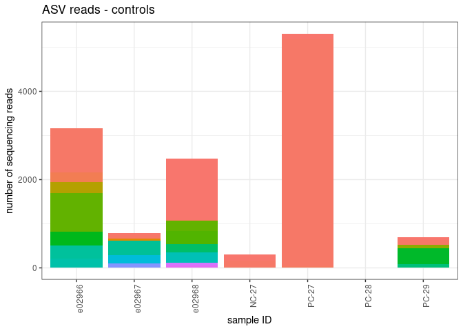
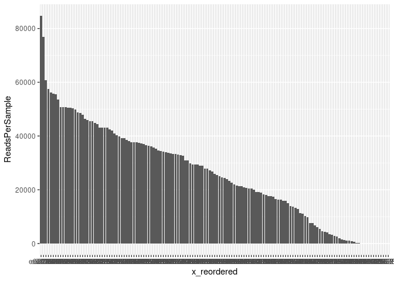
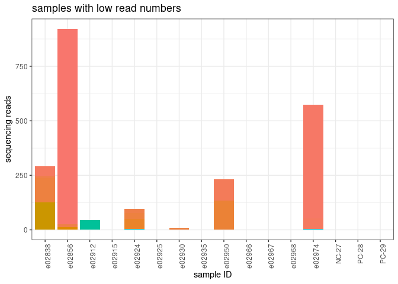
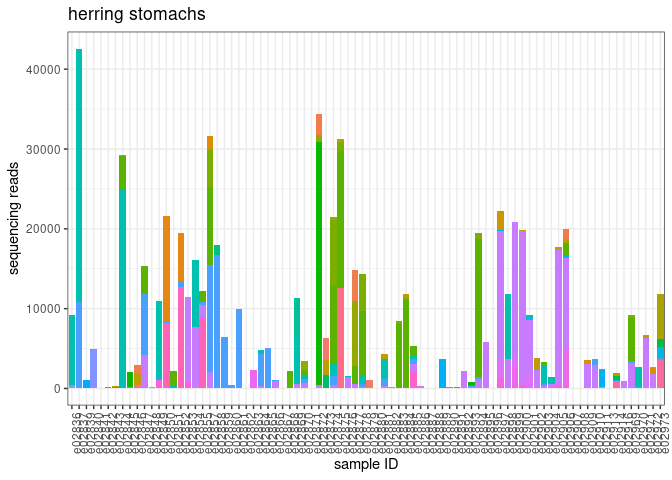
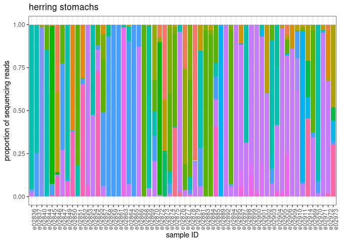
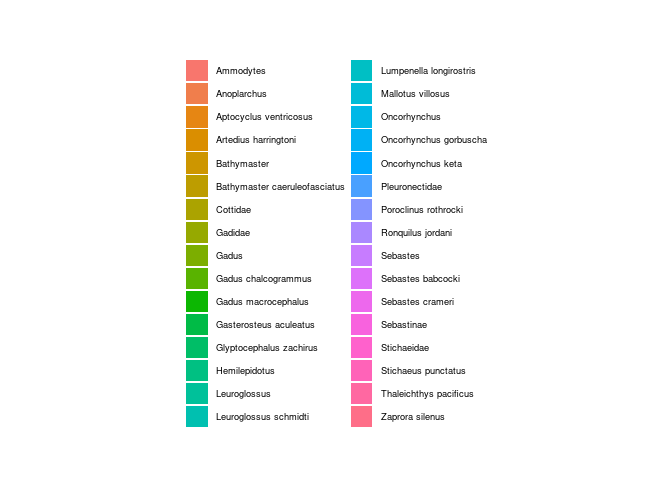
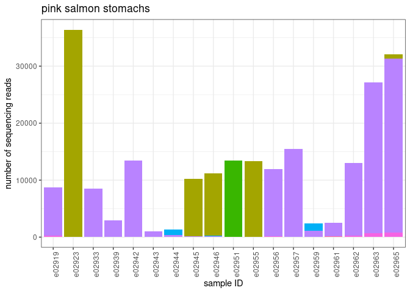
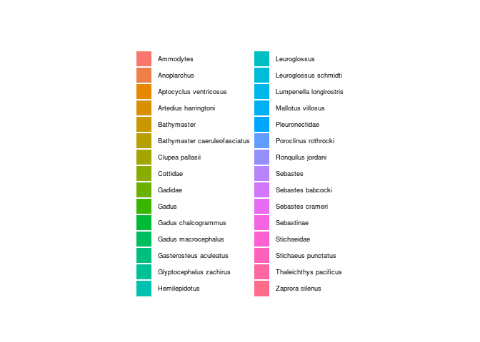

Decontamination and first look at ASVs and samples from the pink salmon
and herring stomach MiFish metabarcoding
================
Kimberly Ledger
2023-11-17

Inputs: This code starts with the ASV table output from dada_blast.sh
that uses dadasnake for preliminary quality control. We also use sample
metadata and a preliminary taxonomic id generated from insect classifier
for MiFish for the ASVs in this code.

Outputs: We will end up with a decontaminated ASV table that can be used
for additional analyses.

Decontamination will involve **these steps**:

**1. Estimate tag-jumping** - There is the potential for barcodes (that
are used to identify the individual samples in a MiSeq run) to be
assigned to the wrong sample for a variety of reasons. While we can’t
tell exactly which mechanism generated these errors, we can still
estimate the occurrence of tag-jumping and account for it in our
dataset. To do this, we will consider our positive control samples
(which have known composition and are extremely unlikely to be present
in the environmental samples) as representatives of the amount of
tag-jumping occurring across the entire dataset. Specifically, what we
will do is subtract the proportion of reads observed in the control
samples from each environmental sample. The output will be a dataset
with the same number of samples and ASVs as before, but with fewer reads
of certain sequences (ASVs). We expect this bias in tag-jumping to be
frequency-dependent (i.e. the more abundant ASVs are more likely to be
found in samples where they are not suppose to be.)

**2. Remove ASVs with no taxonomic assignment or non-fish assignment**

**3. Account for contaminants in positive and negative controls** - We
can use the reads that show up where we know they shouldn’t be (i.e. the
controls) to further clean up the dataset. We will remove ASVs that only
occur in controls and not in environmental samples. And then we will
subtract the maximum number of reads from ASVs found in either the
extraction or pcr controls from all samples. The output will be a
dataset with the same number of samples as before but with fewer ASVs.

**4. Discard PCR replicates with low numbers of reads** - Sometimes PCR
replicates have low read numbers, and therefore will have skewed
relative read proportions. These should be removed. To do this we will
discard samples with \<1000 reads. The output will be a dataset with
fewer samples and potentially fewer ASVs.

# Load libraries and data

load libraries

``` r
library(stringi)
library(rstan)
```

    ## Loading required package: StanHeaders

    ## Loading required package: ggplot2

    ## rstan (Version 2.21.8, GitRev: 2e1f913d3ca3)

    ## For execution on a local, multicore CPU with excess RAM we recommend calling
    ## options(mc.cores = parallel::detectCores()).
    ## To avoid recompilation of unchanged Stan programs, we recommend calling
    ## rstan_options(auto_write = TRUE)

``` r
library(broom)
library(tibble)
library(vegan)
```

    ## Loading required package: permute

    ## Loading required package: lattice

    ## This is vegan 2.6-4

``` r
library(reshape)
library(tidyverse)
```

    ## ── Attaching packages
    ## ───────────────────────────────────────
    ## tidyverse 1.3.2 ──

    ## ✔ tidyr   1.3.0     ✔ dplyr   1.1.2
    ## ✔ readr   2.1.3     ✔ stringr 1.5.0
    ## ✔ purrr   1.0.1     ✔ forcats 0.5.2
    ## ── Conflicts ────────────────────────────────────────── tidyverse_conflicts() ──
    ## ✖ tidyr::expand()  masks reshape::expand()
    ## ✖ tidyr::extract() masks rstan::extract()
    ## ✖ dplyr::filter()  masks stats::filter()
    ## ✖ dplyr::lag()     masks stats::lag()
    ## ✖ dplyr::rename()  masks reshape::rename()

``` r
library(dplyr)
```

load ASV table and metadata

``` r
asv_table <- readRDS("/home/kimberly.ledger/AFSC_eDNA/pink_herring_diet/filtered.seqTab.RDS") %>%
  select(!Row.names)

#transpose 
asv_table <- data.frame(t(asv_table))

#set column names to be ASV# 
colnames(asv_table) <- asv_table["ASV",]

#remove row 
asv_table <- asv_table[-144,]

#make sure reads are numbers
# Convert all character columns to numeric
for (col in names(asv_table)) {
  asv_table[[col]] <- as.numeric(asv_table[[col]])
}

#make make sample ID a column 
asv_table$Sample_ID <- rownames(asv_table)
asv_table$Sample_ID <- as.factor(asv_table$Sample_ID)

metadata <- read.csv("/home/kimberly.ledger/AFSC_eDNA/pink_herring_diet/pinkherring_diet_metadata.csv") %>%
  dplyr::rename(Sample_ID = extraction_ID)

#illumina output changed "_" to "-"
metadata$Sample_ID <- gsub("_", "-", metadata$Sample_ID) 
```

let’s start by taking a closer looks at our dataset

``` r
## number of ASVs 
sum(grepl("ASV", colnames(asv_table)))  
```

    ## [1] 411

``` r
## number of samples in ASV table 
nrow(asv_table)
```

    ## [1] 143

note: sample name PC-29 is actually the negative control from plate 28

Before diving into the decontamination steps, let’s get a feel for what
the data look like.

### positive controls

add column to the ASV table that labels the sample type

``` r
asv_table_with_sample_type <- metadata %>%
  dplyr::select(Sample_ID, sample_type) %>%
  left_join(asv_table, by = "Sample_ID")
```

let’s start by visualizing the reads in the positive control samples

``` r
asv_table_with_sample_type %>%
  pivot_longer(cols = c(3:413), names_to = "ASV", values_to = "reads") %>%
  filter(sample_type == "positive") %>%
  ggplot(aes(x=Sample_ID, y=reads, fill=ASV)) +
  geom_bar(stat = "identity") + 
    theme_bw() +
  labs(
    y = "number of sequencing reads",
    x = "sample ID",
    title = "ASV reads in positive controls") + 
  theme(
    axis.text.x = element_text(angle = 90, hjust = 0.95),
    legend.text = element_text(size = 8),
    legend.key.size = unit(0.3, "cm"),
    legend.position = "none",
    legend.title = element_blank()
  )
```

<!-- -->

top asvs in positive controls

``` r
asvs_PC <- asv_table_with_sample_type %>%
  pivot_longer(cols = c(3:413), names_to = "ASV", values_to = "reads") %>%
  filter(sample_type == "positive") %>%
  group_by(ASV) %>%
  summarise(total = sum(reads)) %>%
  arrange(desc(total))

head(asvs_PC, 6)
```

    ## # A tibble: 6 × 2
    ##   ASV      total
    ##   <chr>    <dbl>
    ## 1 ASV_0012 39344
    ## 2 ASV_0002  5194
    ## 3 ASV_0001   203
    ## 4 ASV_0003    22
    ## 5 ASV_0008     9
    ## 6 ASV_0004     0

### extraction blanks

let me look into the reads that got into the extraction blanks

``` r
asv_table_with_sample_type %>%
  pivot_longer(cols = c(3:413), names_to = "ASV", values_to = "reads") %>%
  filter(sample_type == "extraction_blank") %>%
  ggplot(aes(x=Sample_ID, y=reads, fill=ASV)) +
  geom_bar(stat = "identity") + 
    theme_bw() +
  labs(
    y = "number of sequencing reads",
    x = "sample ID",
    title = "ASV reads - extraction blanks") + 
  theme(
    axis.text.x = element_text(angle = 90, hjust = 0.95),
    legend.text = element_text(size = 8),
    legend.key.size = unit(0.3, "cm"),
    legend.position = "none",
    legend.title = element_blank()
  )
```

<!-- -->

``` r
asvs_EC <- asv_table_with_sample_type %>%
  pivot_longer(cols = c(3:413), names_to = "ASV", values_to = "reads") %>%
  filter(sample_type == "extraction_blank") %>%
  group_by(ASV) %>%
  summarise(total = sum(reads)) %>%
  arrange(desc(total))

head(asvs_EC, 10)
```

    ## # A tibble: 10 × 2
    ##    ASV      total
    ##    <chr>    <dbl>
    ##  1 ASV_0001  1443
    ##  2 ASV_0058  1122
    ##  3 ASV_0002  1079
    ##  4 ASV_0097   374
    ##  5 ASV_0103   318
    ##  6 ASV_0104   311
    ##  7 ASV_0069   299
    ##  8 ASV_0061   290
    ##  9 ASV_0105   288
    ## 10 ASV_0033   253

### pcr blanks

let me look into the reads that got into the pcr blanks

``` r
asv_table_with_sample_type %>%
  pivot_longer(cols = c(3:413), names_to = "ASV", values_to = "reads") %>%
  filter(sample_type == "pcr_blank") %>%
  ggplot(aes(x=Sample_ID, y=reads, fill=ASV)) +
  geom_bar(stat = "identity") + 
    theme_bw() +
  labs(
    y = "number of sequencing reads",
    x = "sample ID",
    title = "ASV reads - pcr negatives") + 
  theme(
    axis.text.x = element_text(angle = 90, hjust = 0.95),
    legend.text = element_text(size = 8),
    legend.key.size = unit(0.3, "cm"),
    legend.position = "none",
    legend.title = element_blank()
  )
```

<!-- -->

``` r
asvs_PCRN <- asv_table_with_sample_type %>%
  pivot_longer(cols = c(3:413), names_to = "ASV", values_to = "reads") %>%
  filter(sample_type == "pcr_blank") %>%
  group_by(ASV) %>%
  summarise(total = sum(reads)) %>%
  arrange(desc(total))

head(asvs_PCRN, 10)
```

    ## # A tibble: 10 × 2
    ##    ASV      total
    ##    <chr>    <dbl>
    ##  1 ASV_0073   363
    ##  2 ASV_0002   249
    ##  3 ASV_0001   198
    ##  4 ASV_0092    82
    ##  5 ASV_0050    75
    ##  6 ASV_0003    28
    ##  7 ASV_0298     3
    ##  8 ASV_0004     0
    ##  9 ASV_0005     0
    ## 10 ASV_0006     0

# 1. Estimate index hopping

subtract the proportion of reads that jumped into the positive control
samples from each environmental sample

identify the maximum proportion of reads for each ASV found in the
positive controls

``` r
prop_asvs_in_positives <- asv_table_with_sample_type %>%
  #filter(sample_type == "positive") %>%
  filter(Sample_ID == "PC-28") %>%
  pivot_longer(cols = c(3:413), names_to = "ASV", values_to = "reads") %>%
  group_by(Sample_ID) %>%
  mutate(TotalReadsPerSample = sum(reads)) %>%
  mutate(Prop = reads/TotalReadsPerSample) %>%
  group_by(ASV) %>%
  summarise(max_prop = max(Prop))
```

subtract the max proportion of tag-jumped reads for each ASV from all
samples

``` r
indexhop_table <- asv_table_with_sample_type %>%
  pivot_longer(cols = c(3:413), names_to = "ASV", values_to = "reads") %>%
  group_by(Sample_ID) %>%
  mutate(TotalReadsPerSample = sum(reads)) %>%
  left_join(prop_asvs_in_positives, by = "ASV") %>%
  mutate(IndexHoppingReads = TotalReadsPerSample*max_prop) %>%
  mutate(reads_IndexHop_removed = reads - IndexHoppingReads) %>%
  mutate(reads_IndexHop_removed = if_else(reads_IndexHop_removed < 0, 0, reads_IndexHop_removed))
head(indexhop_table)
```

    ## # A tibble: 6 × 8
    ## # Groups:   Sample_ID [1]
    ##   Sample_ID sample_type ASV      reads TotalReadsPerSample max_prop
    ##   <chr>     <chr>       <chr>    <dbl>               <dbl>    <dbl>
    ## 1 e02836    sample      ASV_0001     0               24369 0.00167 
    ## 2 e02836    sample      ASV_0002     0               24369 0.000957
    ## 3 e02836    sample      ASV_0003     0               24369 0       
    ## 4 e02836    sample      ASV_0004     0               24369 0       
    ## 5 e02836    sample      ASV_0005     0               24369 0       
    ## 6 e02836    sample      ASV_0006     0               24369 0       
    ## # ℹ 2 more variables: IndexHoppingReads <dbl>, reads_IndexHop_removed <dbl>

note: since \~25% of reads in one of the positive controls was pink
salmon (ASV2), lots of pink salmon reads removed in this step. maybe we
don’t want to do this…? probably better to be conservative here.

clean up the table by removing columns no longer needed

``` r
asv_table_filter1 <- indexhop_table %>%
  dplyr::select(Sample_ID, sample_type, ASV, reads_IndexHop_removed) %>%
  dplyr::rename(reads = reads_IndexHop_removed)
```

this is a summary of the number of reads removed by ASV and sample_ID

``` r
decontaminated_1 <- indexhop_table %>%
  dplyr::select(Sample_ID, ASV, IndexHoppingReads) %>%
  pivot_wider(names_from = "ASV", values_from = "IndexHoppingReads")
head(decontaminated_1)
```

    ## # A tibble: 6 × 412
    ## # Groups:   Sample_ID [6]
    ##   Sample_ID ASV_0001 ASV_0002 ASV_0003 ASV_0004 ASV_0005 ASV_0006 ASV_0007
    ##   <chr>        <dbl>    <dbl>    <dbl>    <dbl>    <dbl>    <dbl>    <dbl>
    ## 1 e02836       40.8     23.3         0        0        0        0        0
    ## 2 e02837       77.9     44.5         0        0        0        0        0
    ## 3 e02838        2.56     1.46        0        0        0        0        0
    ## 4 e02839       31.1     17.8         0        0        0        0        0
    ## 5 e02840       31.0     17.7         0        0        0        0        0
    ## 6 e02841        5.20     2.97        0        0        0        0        0
    ## # ℹ 404 more variables: ASV_0008 <dbl>, ASV_0009 <dbl>, ASV_0010 <dbl>,
    ## #   ASV_0011 <dbl>, ASV_0012 <dbl>, ASV_0013 <dbl>, ASV_0014 <dbl>,
    ## #   ASV_0015 <dbl>, ASV_0016 <dbl>, ASV_0017 <dbl>, ASV_0018 <dbl>,
    ## #   ASV_0019 <dbl>, ASV_0020 <dbl>, ASV_0021 <dbl>, ASV_0022 <dbl>,
    ## #   ASV_0023 <dbl>, ASV_0024 <dbl>, ASV_0025 <dbl>, ASV_0026 <dbl>,
    ## #   ASV_0027 <dbl>, ASV_0028 <dbl>, ASV_0029 <dbl>, ASV_0030 <dbl>,
    ## #   ASV_0031 <dbl>, ASV_0032 <dbl>, ASV_0033 <dbl>, ASV_0034 <dbl>, …

and a list of the proportion of reads from ASVs removed

``` r
prop_removed_1 <- prop_asvs_in_positives %>%
  arrange(desc(max_prop))
head(prop_removed_1)
```

    ## # A tibble: 6 × 2
    ##   ASV      max_prop
    ##   <chr>       <dbl>
    ## 1 ASV_0012 0.997   
    ## 2 ASV_0001 0.00167 
    ## 3 ASV_0002 0.000957
    ## 4 ASV_0003 0       
    ## 5 ASV_0004 0       
    ## 6 ASV_0005 0

# 2. Join to taxonomy and get rid of ASVs with no ID

read in insect taxonomic classifications - keep only ASVs that have an
ID

``` r
tax <- read.csv("asv_taxonomy_insect.csv") %>%
  dplyr::rename(ASV_num = X) %>%
  filter(rank != "class") %>%  # remove ASVs assigned only to class-level
  filter(rank != "no rank") %>%  #remove ASVs with no taxonomic assignment
  filter(class != "Mammalia")
```

``` r
asv_table_filter2 <- asv_table_filter1 %>%
  separate(ASV, into = c("ASV_label", "ASV_num"), remove = F) %>%
  mutate(ASV_num = as.integer(ASV_num)) %>%
  filter(ASV_num %in% tax$ASV_num) %>%
  select(!ASV_label) %>%
  select(!ASV_num)
```

# 3. Account for contaminants in positive and negative controls

next we will remove ASVs that only occur in controls and not in
environmental samples.

let’s start by taking a look at what reads remain in these controls

``` r
asv_table_filter2 %>%
  filter(sample_type != "sample") %>%
  ggplot(aes(x=Sample_ID, y=reads, fill=ASV)) +
  geom_bar(stat = "identity") + 
    theme_bw() +
  labs(
    y = "number of sequencing reads",
    x = "sample ID",
    title = "ASV reads - controls") + 
  theme(
    axis.text.x = element_text(angle = 90, hjust = 0.95),
    legend.text = element_text(size = 8),
    legend.key.size = unit(0.3, "cm"),
    legend.position = "none",
    legend.title = element_blank()
  )
```

<!-- -->

number of reads

``` r
tempA <- asv_table_filter1 %>%
  group_by(ASV, sample_type) %>%
  summarize(TotalReadsPerASV = sum(reads)) %>%
  arrange(ASV)
```

    ## `summarise()` has grouped output by 'ASV'. You can override using the `.groups`
    ## argument.

what ASVs have no reads in samples, but reads in the controls?

``` r
tempB <- tempA %>%
  pivot_wider(names_from = "sample_type", values_from = c("TotalReadsPerASV")) %>%
    filter(sample < 1)
head(tempB)
```

    ## # A tibble: 6 × 5
    ## # Groups:   ASV [6]
    ##   ASV      extraction_blank pcr_blank positive sample
    ##   <chr>               <dbl>     <dbl>    <dbl>  <dbl>
    ## 1 ASV_0012                0         0        0      0
    ## 2 ASV_0097              374         0        0      0
    ## 3 ASV_0103              318         0        0      0
    ## 4 ASV_0104              311         0        0      0
    ## 5 ASV_0114              231         0        0      0
    ## 6 ASV_0128              184         0        0      0

remove these from the data frame

``` r
asv_table_filter2.5 <- asv_table_filter2 %>%
  filter(!ASV %in% tempB$ASV)
```

how much does this change things?

``` r
asv_table_filter2.5 %>%
  filter(sample_type != "sample") %>%
  ggplot(aes(x=Sample_ID, y=reads, fill=ASV)) +
  geom_bar(stat = "identity") + 
    theme_bw() +
  labs(
    y = "number of sequencing reads",
    x = "sample ID",
    title = "ASV reads - controls") + 
  theme(
    axis.text.x = element_text(angle = 90, hjust = 0.95),
    legend.text = element_text(size = 8),
    legend.key.size = unit(0.3, "cm"),
    legend.position = "none",
    legend.title = element_blank()
  )
```

<!-- -->

next we will subtract the maximum number of reads from ASVs found in the
extraction and pcr negative controls from all samples.

calculate the maximum number of reads in an ASV to still show up in an
extraction or PCR control

``` r
reads_to_remove_per_ASV <- asv_table_filter2.5 %>%
  filter(sample_type == "extraction_blank"| sample_type == "pcr_blank") %>%
  group_by(ASV) %>%
  summarize(max_reads = max(reads))

reads_to_remove_per_sample <- asv_table_filter2.5 %>%
  left_join(reads_to_remove_per_ASV, by = "ASV") %>%
  mutate(read_minus_contamination = reads - max_reads) %>%
  mutate(read_minus_contamination = if_else(read_minus_contamination < 0, 0, read_minus_contamination))
```

filter the data frame

``` r
asv_table_filter3 <- reads_to_remove_per_sample %>%
  dplyr::select(!reads) %>%
  dplyr::select(!max_reads) %>%
  dplyr::rename(reads = read_minus_contamination)
```

number of ASVs remaining

``` r
length(unique(asv_table_filter3$ASV)) 
```

    ## [1] 149

this step does remove a lot of reads from some of the ASVs but i think
this is okay since read numbers are quite high and we should see a clear
picture of species presence despite removing these reads

# 4. Discard PCR replicates with low numbers of reads

calculate reads per sample

``` r
all_reads <- asv_table_filter3 %>%
  group_by(Sample_ID) %>%
  summarize(ReadsPerSample = sum(reads))
```

visualize

``` r
all_reads$x_reordered <- reorder(all_reads$Sample_ID, -all_reads$ReadsPerSample)

all_reads %>%
  ggplot(aes(x = x_reordered, y = ReadsPerSample)) + 
  geom_bar(stat = "identity")
```

<!-- -->

fit a normal distribution

``` r
fit <- MASS::fitdistr(all_reads$ReadsPerSample, "normal")

all_reads %>%  
  mutate(prob = pnorm(all_reads$ReadsPerSample, fit$estimate[[1]], fit$estimate[[2]])) -> all_reads
```

identify and remove the outliers

``` r
#low_dist_probability_cutoff <- 0.05
minimum_read_cutoff <- 1000

outliers <- all_reads %>% 
  #filter(prob < low_dist_probability_cutoff | ReadsPerSample < minimum_read_cutoff)
  filter(ReadsPerSample < minimum_read_cutoff)

outlierIDs <- outliers$Sample_ID
```

which samples are removed because of the 1000 reads threshold??

``` r
replicates_removed <- asv_table_filter3 %>%
  filter(Sample_ID %in% outlierIDs) %>%
  pivot_wider(names_from = "ASV", values_from = "reads")
#head(replicates_removed_2)
```

number of pcr replicates removed

``` r
nrow(replicates_removed)
```

    ## [1] 16

plot them

``` r
replicates_removed %>%
  pivot_longer(cols = c(3:151), names_to = "ASV", values_to = "count") %>%
ggplot(aes(x=Sample_ID, y=count, fill=ASV)) +
  geom_bar(stat = "identity") + 
    theme_bw() + 
   labs(
    y = "sequencing reads",
    x = "sample ID",
    title = "samples with low read numbers")  +
  theme(
    axis.text.x = element_text(angle = 90, hjust = 0.95),
    legend.position = "none",
    legend.title = element_blank()
  )  
```

<!-- -->

filter the data frame

``` r
asv_table_filter4 <- asv_table_filter3 %>%
  filter(!Sample_ID %in% outlierIDs)
```

# DONE with read decontamination.

# join to taxononmy and group reads

``` r
taxon_table <- asv_table_filter4 %>%
  separate(ASV, into = c("ASV_label", "ASV_num"), remove = F) %>%
  mutate(ASV_num = as.integer(ASV_num)) %>%
  left_join(tax, by = "ASV_num") %>%
  select(!ASV_label) %>%
  select(!ASV_num) %>% 
  select(!representative) %>%
  select(!taxID) %>%
  select(!score) %>%
  group_by(Sample_ID, taxon, rank, order, family, genus, species) %>%
  summarize(reads = sum(reads))
```

    ## `summarise()` has grouped output by 'Sample_ID', 'taxon', 'rank', 'order',
    ## 'family', 'genus'. You can override using the `.groups` argument.

# join the sample metadata so that we know which species of fish the sample came from…

``` r
taxon_table_w_meta <- taxon_table %>%
  left_join(metadata, by = "Sample_ID")
```

any taxa have very few reads?

``` r
taxa_total <- taxon_table_w_meta %>%
  group_by(taxon) %>%
  summarize(total = sum(reads)) %>%
  arrange(total) %>%
  filter(total < 1000)
```

yes, since the goal of this study is not to identify rare things, i am
going to remove any taxa with \>1000 reads total across all samples

``` r
taxon_table_w_meta <- taxon_table_w_meta %>%
  filter(!taxon %in% taxa_total$taxon)
```

# Pacific herring

# first let’s look at what species are the in Pacific herring stomach samples

``` r
herring_stomachs <- taxon_table_w_meta %>% 
  filter(Species == "Pacific herring")

herring_stomachs %>%
  group_by(taxon) %>%
  summarise(total = sum(reads)) %>%
  arrange(desc(total))
```

    ## # A tibble: 33 × 2
    ##    taxon                     total
    ##    <chr>                     <dbl>
    ##  1 Clupea pallasii        1342935.
    ##  2 Sebastes                153517 
    ##  3 Leuroglossus schmidti   108830 
    ##  4 Gadus chalcogrammus     105254 
    ##  5 Pleuronectidae           81994 
    ##  6 Gadus macrocephalus      32860 
    ##  7 Stichaeus punctatus      29225 
    ##  8 Gadus                    20510 
    ##  9 Aptocyclus ventricosus   19231 
    ## 10 Zaprora silenus          12694 
    ## # ℹ 23 more rows

how many samples?

``` r
length(unique(herring_stomachs$Sample_ID))
```

    ## [1] 82

plot reads without herring

``` r
herring_stomachs %>%
  filter(family != "Clupeidae") %>%
ggplot(aes(x=Sample_ID, y=reads, fill=taxon)) +
  geom_bar(stat = "identity") + 
    theme_bw() + 
   labs(
    y = "sequencing reads",
    x = "sample ID",
    title = "herring stomachs")  +
  theme(
    axis.text.x = element_text(angle = 90, hjust = 0.95),
    legend.position = "none",
    legend.title = element_blank()
  )  
```

<!-- -->

okay, seems like quite a diversity of a taxa here.

let’s start by saying a sample need \>1000 non-herring reads in order to
establish its diet

``` r
herring_diet <- herring_stomachs %>%
  filter(family != "Clupeidae") %>%
  group_by(Sample_ID) %>%
  mutate(ReadsPerSample = sum(reads)) %>%
  filter(ReadsPerSample > 1000) %>%
  mutate(read_prop = reads/ReadsPerSample)
```

how many samples?

``` r
length(unique(herring_diet$Sample_ID))
```

    ## [1] 60

plot them - number of reads

``` r
herring_diet %>%
ggplot(aes(x=Sample_ID, y=reads, fill=taxon)) +
  geom_bar(stat = "identity") + 
    theme_bw() + 
   labs(
    y = "number  of sequencing reads",
    x = "sample ID",
    title = "herring stomachs")  +
  theme(
    axis.text.x = element_text(angle = 90, hjust = 0.95),
    legend.position = "none",
    legend.title = element_blank()
  )  
```

<!-- -->

plot them - proportion

``` r
herring_diet %>%
ggplot(aes(x=Sample_ID, y=read_prop, fill=taxon)) +
  geom_bar(stat = "identity") + 
    theme_bw() + 
   labs(
    y = "proportion of sequencing reads",
    x = "sample ID",
    title = "herring stomachs")  +
  theme(
    axis.text.x = element_text(angle = 90, hjust = 0.95),
    legend.position = "none",
    legend.title = element_blank()
  )  
```

<!-- -->

what taxa are these colors?

``` r
for_legend <- herring_diet %>%
  ggplot(aes(x=Sample_ID, y=read_prop, fill=taxon)) +
  geom_bar(stat = "identity") + 
  theme_bw() +
  theme(
    axis.text.x = element_blank(),
    legend.position = "right",
    legend.text = element_text(size = 7),
    legend.title = element_blank()
  )  

library(grid)
library(gridExtra) 
```

    ## 
    ## Attaching package: 'gridExtra'

    ## The following object is masked from 'package:dplyr':
    ## 
    ##     combine

``` r
# Using the cowplot package
legend <- cowplot::get_legend(for_legend)

grid.newpage()
grid.draw(legend)
```

<!-- -->

still pretty hard to tell what’s what. should have someone verify that
these taxa look okay. i.e. nothing from outside the range

let’s make a list of what taxa make up at least 25% of the reads in at
least one sample

``` r
herring_diet %>%
  filter(read_prop >= 0.25) %>%
  group_by(taxon) %>%
  summarize(num = n()) %>%
  arrange(desc(num))
```

    ## # A tibble: 22 × 2
    ##    taxon                           num
    ##    <chr>                         <int>
    ##  1 Sebastes                         21
    ##  2 Leuroglossus schmidti            11
    ##  3 Gadus chalcogrammus              10
    ##  4 Pleuronectidae                    8
    ##  5 Bathymaster caeruleofasciatus     3
    ##  6 Stichaeus punctatus               3
    ##  7 Ammodytes                         2
    ##  8 Anoplarchus                       2
    ##  9 Aptocyclus ventricosus            2
    ## 10 Gadidae                           2
    ## # ℹ 12 more rows

okay, not much pink salmon. part of this might be due to so many pink
salmon reads being removed during decontamination… but it’s hard to say
whether or not those are not contamination.

are there any salmon reads in samples now?

how many samples have pink salmon reads that make up \>5% of reads

``` r
herring_diet %>%
  filter(taxon == "Oncorhynchus gorbuscha" & reads > 0)
```

    ## # A tibble: 2 × 22
    ## # Groups:   Sample_ID [2]
    ##   Sample_ID taxon          rank  order family genus species reads FishID Species
    ##   <chr>     <chr>          <chr> <chr> <chr>  <chr> <chr>   <dbl> <chr>  <chr>  
    ## 1 e02889    Oncorhynchus … spec… Salm… Salmo… Onco… Oncorh… 3745. 23-5-… Pacifi…
    ## 2 e02911    Oncorhynchus … spec… Salm… Salmo… Onco… Oncorh… 2131. 23-5-… Pacifi…
    ## # ℹ 12 more variables: collection_year <int>, collection_month <int>,
    ## #   collection_day <int>, location <chr>, sample_type <chr>,
    ## #   extraction_by <chr>, extraction_date <chr>, plate_or_vial <chr>,
    ## #   extraction_plate <chr>, extraction_well <chr>, ReadsPerSample <dbl>,
    ## #   read_prop <dbl>

``` r
herring_diet %>%
  filter(taxon == "Oncorhynchus" & reads > 0)
```

    ## # A tibble: 7 × 22
    ## # Groups:   Sample_ID [7]
    ##   Sample_ID taxon        rank  order   family genus species reads FishID Species
    ##   <chr>     <chr>        <chr> <chr>   <chr>  <chr> <chr>   <dbl> <chr>  <chr>  
    ## 1 e02849    Oncorhynchus genus Salmon… Salmo… Onco… ""        241 23-5-… Pacifi…
    ## 2 e02852    Oncorhynchus genus Salmon… Salmo… Onco… ""         32 23-5-… Pacifi…
    ## 3 e02897    Oncorhynchus genus Salmon… Salmo… Onco… ""         50 23-5-… Pacifi…
    ## 4 e02901    Oncorhynchus genus Salmon… Salmo… Onco… ""        388 23-5-… Pacifi…
    ## 5 e02906    Oncorhynchus genus Salmon… Salmo… Onco… ""        262 23-5-… Pacifi…
    ## 6 e02914    Oncorhynchus genus Salmon… Salmo… Onco… ""        240 23-5-… Pacifi…
    ## 7 e02973    Oncorhynchus genus Salmon… Salmo… Onco… ""       1369 23-5-… Pacifi…
    ## # ℹ 12 more variables: collection_year <int>, collection_month <int>,
    ## #   collection_day <int>, location <chr>, sample_type <chr>,
    ## #   extraction_by <chr>, extraction_date <chr>, plate_or_vial <chr>,
    ## #   extraction_plate <chr>, extraction_well <chr>, ReadsPerSample <dbl>,
    ## #   read_prop <dbl>

okay, it seems unlikely that pink salmon are apart of herring diet.

# Pink salmon

# first let’s look at what species are the in Pacific herring stomach samples

``` r
pink_stomachs <- taxon_table_w_meta %>% 
  filter(Species == "Pink salmon")

pink_stomachs %>%
  group_by(taxon) %>%
  summarise(total = sum(reads)) %>%
  arrange(desc(total))
```

    ## # A tibble: 33 × 2
    ##    taxon                     total
    ##    <chr>                     <dbl>
    ##  1 Oncorhynchus gorbuscha 1211353.
    ##  2 Oncorhynchus keta       191626 
    ##  3 Sebastes                137836 
    ##  4 Clupea pallasii          71405.
    ##  5 Oncorhynchus             69938 
    ##  6 Gadus                    13535 
    ##  7 Mallotus villosus         2385 
    ##  8 Sebastinae                2185 
    ##  9 Cottidae                   405 
    ## 10 Leuroglossus schmidti      178 
    ## # ℹ 23 more rows

how many samples?

``` r
length(unique(pink_stomachs$Sample_ID))
```

    ## [1] 44

plot reads without salmon reads - i’m guessing that all Oncorhynchus
reads here are from the pink salmon even though their taxon assignments
differ… unless pink salmon fry eat chum or other salmon???

``` r
pink_stomachs %>%
  filter(taxon != "Oncorhynchus gorbuscha") %>% 
  filter(taxon != "Oncorhynchus") %>%
  filter(taxon != "Oncorhynchus keta") %>%  
ggplot(aes(x=Sample_ID, y=reads, fill=taxon)) +
  geom_bar(stat = "identity") + 
    theme_bw() + 
   labs(
    y = "sequencing reads",
    x = "sample ID",
    title = "pink salmon stomachs")  +
  theme(
    axis.text.x = element_text(angle = 90, hjust = 0.95),
    legend.position = "none",
    legend.title = element_blank()
  )  
```

<!-- -->

okay, not many taxa here and only in a few samples.

let’s start by saying a sample need \>1000 non-herring reads in order to
establish its diet

``` r
pink_diet <- pink_stomachs %>%
  filter(taxon != "Oncorhynchus gorbuscha") %>% 
  filter(taxon != "Oncorhynchus") %>%
  filter(taxon != "Oncorhynchus keta") %>%
  group_by(Sample_ID) %>%
  mutate(ReadsPerSample = sum(reads)) %>%
  filter(ReadsPerSample > 1000) %>%
  mutate(read_prop = reads/ReadsPerSample)
```

how many samples?

``` r
length(unique(pink_diet$Sample_ID))
```

    ## [1] 18

plot them

``` r
pink_diet %>%
ggplot(aes(x=Sample_ID, y=reads, fill=taxon)) +
  geom_bar(stat = "identity") + 
    theme_bw() + 
   labs(
    y = "number of sequencing reads",
    x = "sample ID",
    title = "pink salmon stomachs")  +
  theme(
    axis.text.x = element_text(angle = 90, hjust = 0.95),
    legend.position = "none",
    legend.title = element_blank()
  )  
```

<!-- -->

plot them

``` r
pink_diet %>%
ggplot(aes(x=Sample_ID, y=read_prop, fill=taxon)) +
  geom_bar(stat = "identity") + 
    theme_bw() + 
   labs(
    y = "proportion of sequencing reads",
    x = "sample ID",
    title = "pink salmon stomachs")  +
  theme(
    axis.text.x = element_text(angle = 90, hjust = 0.95),
    legend.position = "none",
    legend.title = element_blank()
  )  
```

<!-- -->

what taxa are these colors?

``` r
for_legend <- pink_diet %>%
  ggplot(aes(x=Sample_ID, y=read_prop, fill=taxon)) +
  geom_bar(stat = "identity") + 
  theme_bw() +
  theme(
    axis.text.x = element_blank(),
    legend.position = "right",
    legend.text = element_text(size = 7),
    legend.title = element_blank()
  )  

library(grid)
library(gridExtra) 

# Using the cowplot package
legend <- cowplot::get_legend(for_legend)

grid.newpage()
grid.draw(legend)
```

<!-- -->

let’s make a list of what taxa make up at least 25% of the reads in at
least one sample

``` r
pink_diet %>%
  filter(read_prop >= 0.25) %>%
  group_by(taxon) %>%
  summarize(num = n()) %>%
  arrange(desc(num))
```

    ## # A tibble: 4 × 2
    ##   taxon               num
    ##   <chr>             <int>
    ## 1 Sebastes             13
    ## 2 Clupea pallasii       4
    ## 3 Mallotus villosus     2
    ## 4 Gadus                 1

herring in 4 of the pink salmon stomachs
