Decontamination and preliminary analysis of ASVs and samples from the
pink salmon and herring stomach MiFish metabarcoding
================
Kimberly Ledger
2023-11-21

Inputs: This code starts with the ASV table output from dada_blast.sh
that uses dadasnake for preliminary quality control. We also use sample
metadata and taxonomic id generated from insect classifier for MiFish
and blast for the ASVs in this code.

Outputs: We will end up with a decontaminated taxonomy table that can be
used for additional analyses.

Decontamination will involve **these steps**:

**1. Estimate tag-jumping** - There is the potential for barcodes (that
are used to identify the individual samples in a MiSeq run) to be
assigned to the wrong sample for a variety of reasons. While we can’t
tell exactly which mechanism generated these errors, we can still
estimate the occurrence of tag-jumping and account for it in our
dataset. To do this, we will consider our positive control samples
(which have known composition and are extremely unlikely to be present
in the environmental samples) as representatives of the amount of
tag-jumping occurring across the entire dataset. Specifically, what we
will do is subtract the proportion of reads observed in the control
samples from each environmental sample. The output will be a dataset
with the same number of samples and ASVs as before, but with fewer reads
of certain sequences (ASVs). We expect this bias in tag-jumping to be
frequency-dependent (i.e. the more abundant ASVs are more likely to be
found in samples where they are not suppose to be.)

**2. Account for contaminants in positive and negative controls** - We
can use the reads that show up where we know they shouldn’t be (i.e. the
controls) to further clean up the dataset. We will remove ASVs that only
occur in controls and not in environmental samples. And then we will
subtract the maximum number of reads from ASVs found in either the
extraction or pcr controls from all samples. The output will be a
dataset with the same number of samples as before but with fewer ASVs.

**3. Discard PCR replicates with low numbers of reads** - Sometimes PCR
replicates have low read numbers, and therefore will have skewed
relative read proportions. These should be removed. To do this we will
discard samples with \<1000 reads. The output will be a dataset with
fewer samples and potentially fewer ASVs.

**4. Remove ASVs with low numbers of reads**

## Load libraries and data

load libraries

``` r
library(tidyverse)
library(dplyr)
```

load ASV table and metadata

``` r
asv_table <- readRDS("/home/kimberly.ledger/AFSC_eDNA/pink_herring_diet/filtered.seqTab.RDS") %>%
  select(!Row.names)

#transpose 
asv_table <- data.frame(t(asv_table))

#set column names to be ASV# 
colnames(asv_table) <- asv_table["ASV",]

#remove row 
asv_table <- asv_table[-144,]

#make sure reads are numbers
# Convert all character columns to numeric
for (col in names(asv_table)) {
  asv_table[[col]] <- as.numeric(asv_table[[col]])
}

#make make sample ID a column 
asv_table$Sample_ID <- rownames(asv_table)
asv_table$Sample_ID <- as.factor(asv_table$Sample_ID)

metadata <- read.csv("/home/kimberly.ledger/AFSC_eDNA/pink_herring_diet/pinkherring_diet_metadata.csv") %>%
  dplyr::rename(Sample_ID = extraction_ID)

#illumina output changed "_" to "-"
metadata$Sample_ID <- gsub("_", "-", metadata$Sample_ID) 
```

let’s start by taking a closer looks at our dataset

``` r
## number of ASVs 
sum(grepl("ASV", colnames(asv_table)))  
```

    ## [1] 411

``` r
## number of samples in ASV table 
nrow(asv_table)
```

    ## [1] 143

note: sample name “PC-29” is actually the negative control from plate 28

before diving into the decontamination steps, let’s get a feel for what
the data look like.

### positive controls

add column to the ASV table that labels the sample type

``` r
asv_table_with_sample_type <- metadata %>%
  dplyr::select(Sample_ID, sample_type) %>%
  left_join(asv_table, by = "Sample_ID")
```

let’s start by visualizing the reads in the positive control samples

``` r
asv_table_with_sample_type %>%
  pivot_longer(cols = c(3:413), names_to = "ASV", values_to = "reads") %>%
  filter(sample_type == "positive") %>%
  ggplot(aes(x=Sample_ID, y=reads, fill=ASV)) +
  geom_bar(stat = "identity") + 
    theme_bw() +
  labs(
    y = "number of sequencing reads",
    x = "sample ID",
    title = "ASV reads in positive controls") + 
  theme(
    axis.text.x = element_text(angle = 90, hjust = 0.95),
    legend.text = element_text(size = 8),
    legend.key.size = unit(0.3, "cm"),
    legend.position = "none",
    legend.title = element_blank()
  )
```

<!-- -->

top asvs in positive controls

``` r
asvs_PC <- asv_table_with_sample_type %>%
  pivot_longer(cols = c(3:413), names_to = "ASV", values_to = "reads") %>%
  filter(sample_type == "positive") %>%
  group_by(ASV) %>%
  summarise(total = sum(reads)) %>%
  arrange(desc(total))

head(asvs_PC, 6)
```

    ## # A tibble: 6 × 2
    ##   ASV      total
    ##   <chr>    <dbl>
    ## 1 ASV_0012 39344
    ## 2 ASV_0002  5194
    ## 3 ASV_0001   203
    ## 4 ASV_0003    22
    ## 5 ASV_0008     9
    ## 6 ASV_0004     0

### extraction blanks

let me look into the reads that got into the extraction blanks

``` r
asv_table_with_sample_type %>%
  pivot_longer(cols = c(3:413), names_to = "ASV", values_to = "reads") %>%
  filter(sample_type == "extraction_blank") %>%
  ggplot(aes(x=Sample_ID, y=reads, fill=ASV)) +
  geom_bar(stat = "identity") + 
    theme_bw() +
  labs(
    y = "number of sequencing reads",
    x = "sample ID",
    title = "ASV reads - extraction blanks") + 
  theme(
    axis.text.x = element_text(angle = 90, hjust = 0.95),
    legend.text = element_text(size = 8),
    legend.key.size = unit(0.3, "cm"),
    legend.position = "none",
    legend.title = element_blank()
  )
```

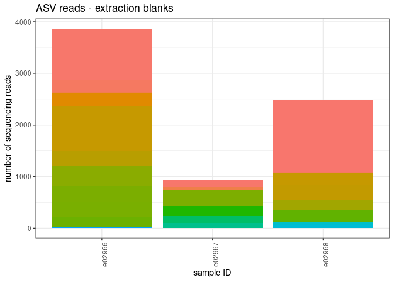<!-- -->

``` r
asvs_EC <- asv_table_with_sample_type %>%
  pivot_longer(cols = c(3:413), names_to = "ASV", values_to = "reads") %>%
  filter(sample_type == "extraction_blank") %>%
  group_by(ASV) %>%
  summarise(total = sum(reads)) %>%
  arrange(desc(total))

head(asvs_EC, 10)
```

    ## # A tibble: 10 × 2
    ##    ASV      total
    ##    <chr>    <dbl>
    ##  1 ASV_0001  1443
    ##  2 ASV_0058  1122
    ##  3 ASV_0002  1079
    ##  4 ASV_0097   374
    ##  5 ASV_0103   318
    ##  6 ASV_0104   311
    ##  7 ASV_0069   299
    ##  8 ASV_0061   290
    ##  9 ASV_0105   288
    ## 10 ASV_0033   253

### pcr blanks

let me look into the reads that got into the pcr blanks

``` r
asv_table_with_sample_type %>%
  pivot_longer(cols = c(3:413), names_to = "ASV", values_to = "reads") %>%
  filter(sample_type == "pcr_blank") %>%
  ggplot(aes(x=Sample_ID, y=reads, fill=ASV)) +
  geom_bar(stat = "identity") + 
    theme_bw() +
  labs(
    y = "number of sequencing reads",
    x = "sample ID",
    title = "ASV reads - pcr negatives") + 
  theme(
    axis.text.x = element_text(angle = 90, hjust = 0.95),
    legend.text = element_text(size = 8),
    legend.key.size = unit(0.3, "cm"),
    legend.position = "none",
    legend.title = element_blank()
  )
```

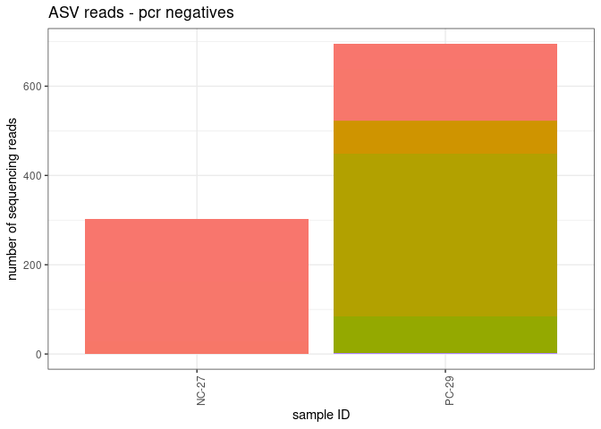<!-- -->

``` r
asvs_PCRN <- asv_table_with_sample_type %>%
  pivot_longer(cols = c(3:413), names_to = "ASV", values_to = "reads") %>%
  filter(sample_type == "pcr_blank") %>%
  group_by(ASV) %>%
  summarise(total = sum(reads)) %>%
  arrange(desc(total))

head(asvs_PCRN, 10)
```

    ## # A tibble: 10 × 2
    ##    ASV      total
    ##    <chr>    <dbl>
    ##  1 ASV_0073   363
    ##  2 ASV_0002   249
    ##  3 ASV_0001   198
    ##  4 ASV_0092    82
    ##  5 ASV_0050    75
    ##  6 ASV_0003    28
    ##  7 ASV_0298     3
    ##  8 ASV_0004     0
    ##  9 ASV_0005     0
    ## 10 ASV_0006     0

## 1. Estimate index hopping

subtract the proportion of reads that jumped into the positive control
samples from each environmental sample

identify the maximum proportion of reads for each ASV found in the
positive controls

``` r
prop_asvs_in_positives <- asv_table_with_sample_type %>%
  #filter(sample_type == "positive") %>%
  filter(Sample_ID == "PC-28") %>%
  pivot_longer(cols = c(3:413), names_to = "ASV", values_to = "reads") %>%
  group_by(Sample_ID) %>%
  mutate(TotalReadsPerSample = sum(reads)) %>%
  mutate(Prop = reads/TotalReadsPerSample) %>%
  group_by(ASV) %>%
  summarise(max_prop = max(Prop))
```

subtract the max proportion of tag-jumped reads for each ASV from all
samples

``` r
indexhop_table <- asv_table_with_sample_type %>%
  pivot_longer(cols = c(3:413), names_to = "ASV", values_to = "reads") %>%
  group_by(Sample_ID) %>%
  mutate(TotalReadsPerSample = sum(reads)) %>%
  left_join(prop_asvs_in_positives, by = "ASV") %>%
  mutate(IndexHoppingReads = TotalReadsPerSample*max_prop) %>%
  mutate(reads_IndexHop_removed = reads - IndexHoppingReads) %>%
  mutate(reads_IndexHop_removed = if_else(reads_IndexHop_removed < 0, 0, reads_IndexHop_removed))
head(indexhop_table)
```

    ## # A tibble: 6 × 8
    ## # Groups:   Sample_ID [1]
    ##   Sample_ID sample_type ASV      reads TotalReadsPerSample max_prop
    ##   <chr>     <chr>       <chr>    <dbl>               <dbl>    <dbl>
    ## 1 e02836    sample      ASV_0001     0               24369 0.00167 
    ## 2 e02836    sample      ASV_0002     0               24369 0.000957
    ## 3 e02836    sample      ASV_0003     0               24369 0       
    ## 4 e02836    sample      ASV_0004     0               24369 0       
    ## 5 e02836    sample      ASV_0005     0               24369 0       
    ## 6 e02836    sample      ASV_0006     0               24369 0       
    ## # ℹ 2 more variables: IndexHoppingReads <dbl>, reads_IndexHop_removed <dbl>

note: only basing tag jumping estimates on one of the positive controls

clean up the table by removing columns no longer needed

``` r
asv_table_filter1 <- indexhop_table %>%
  dplyr::select(Sample_ID, sample_type, ASV, reads_IndexHop_removed) %>%
  dplyr::rename(reads = reads_IndexHop_removed)
```

this is a summary of the number of reads removed by ASV and sample_ID

``` r
decontaminated_1 <- indexhop_table %>%
  dplyr::select(Sample_ID, ASV, IndexHoppingReads) %>%
  pivot_wider(names_from = "ASV", values_from = "IndexHoppingReads")
head(decontaminated_1)
```

    ## # A tibble: 6 × 412
    ## # Groups:   Sample_ID [6]
    ##   Sample_ID ASV_0001 ASV_0002 ASV_0003 ASV_0004 ASV_0005 ASV_0006 ASV_0007
    ##   <chr>        <dbl>    <dbl>    <dbl>    <dbl>    <dbl>    <dbl>    <dbl>
    ## 1 e02836       40.8     23.3         0        0        0        0        0
    ## 2 e02837       77.9     44.5         0        0        0        0        0
    ## 3 e02838        2.56     1.46        0        0        0        0        0
    ## 4 e02839       31.1     17.8         0        0        0        0        0
    ## 5 e02840       31.0     17.7         0        0        0        0        0
    ## 6 e02841        5.20     2.97        0        0        0        0        0
    ## # ℹ 404 more variables: ASV_0008 <dbl>, ASV_0009 <dbl>, ASV_0010 <dbl>,
    ## #   ASV_0011 <dbl>, ASV_0012 <dbl>, ASV_0013 <dbl>, ASV_0014 <dbl>,
    ## #   ASV_0015 <dbl>, ASV_0016 <dbl>, ASV_0017 <dbl>, ASV_0018 <dbl>,
    ## #   ASV_0019 <dbl>, ASV_0020 <dbl>, ASV_0021 <dbl>, ASV_0022 <dbl>,
    ## #   ASV_0023 <dbl>, ASV_0024 <dbl>, ASV_0025 <dbl>, ASV_0026 <dbl>,
    ## #   ASV_0027 <dbl>, ASV_0028 <dbl>, ASV_0029 <dbl>, ASV_0030 <dbl>,
    ## #   ASV_0031 <dbl>, ASV_0032 <dbl>, ASV_0033 <dbl>, ASV_0034 <dbl>, …

and a list of the proportion of reads from ASVs removed

``` r
prop_removed_1 <- prop_asvs_in_positives %>%
  arrange(desc(max_prop))
head(prop_removed_1)
```

    ## # A tibble: 6 × 2
    ##   ASV      max_prop
    ##   <chr>       <dbl>
    ## 1 ASV_0012 0.997   
    ## 2 ASV_0001 0.00167 
    ## 3 ASV_0002 0.000957
    ## 4 ASV_0003 0       
    ## 5 ASV_0004 0       
    ## 6 ASV_0005 0

## 2. Account for contaminants in positive and negative controls

next we will remove ASVs that only occur in controls and not in
environmental samples.

let’s start by taking a look at what reads remain in these controls

``` r
asv_table_filter1 %>%
  filter(sample_type != "sample") %>%
  ggplot(aes(x=Sample_ID, y=reads, fill=ASV)) +
  geom_bar(stat = "identity") + 
    theme_bw() +
  labs(
    y = "number of sequencing reads",
    x = "sample ID",
    title = "ASV reads - controls") + 
  theme(
    axis.text.x = element_text(angle = 90, hjust = 0.95),
    legend.text = element_text(size = 8),
    legend.key.size = unit(0.3, "cm"),
    legend.position = "none",
    legend.title = element_blank()
  )
```

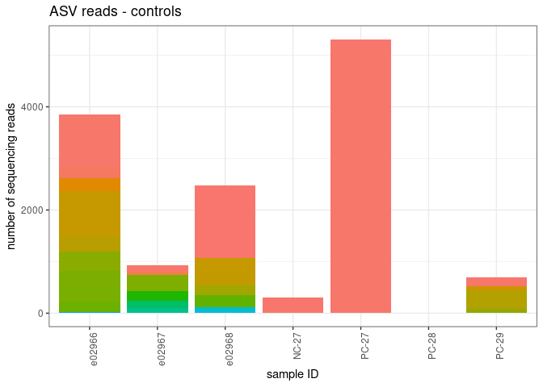<!-- -->

number of reads

``` r
tempA <- asv_table_filter1 %>%
  group_by(ASV, sample_type) %>%
  summarize(TotalReadsPerASV = sum(reads)) %>%
  arrange(ASV)
```

    ## `summarise()` has grouped output by 'ASV'. You can override using the `.groups`
    ## argument.

what ASVs have no reads in samples, but reads in the controls?

``` r
tempB <- tempA %>%
  pivot_wider(names_from = "sample_type", values_from = c("TotalReadsPerASV")) %>%
    filter(sample < 1)
head(tempB)
```

    ## # A tibble: 6 × 5
    ## # Groups:   ASV [6]
    ##   ASV      extraction_blank pcr_blank positive sample
    ##   <chr>               <dbl>     <dbl>    <dbl>  <dbl>
    ## 1 ASV_0012                0         0        0      0
    ## 2 ASV_0097              374         0        0      0
    ## 3 ASV_0103              318         0        0      0
    ## 4 ASV_0104              311         0        0      0
    ## 5 ASV_0114              231         0        0      0
    ## 6 ASV_0128              184         0        0      0

remove these from the data frame

``` r
asv_table_filter1.5 <- asv_table_filter1 %>%
  filter(!ASV %in% tempB$ASV)
```

how much does this change things?

``` r
asv_table_filter1.5 %>%
  filter(sample_type != "sample") %>%
  ggplot(aes(x=Sample_ID, y=reads, fill=ASV)) +
  geom_bar(stat = "identity") + 
    theme_bw() +
  labs(
    y = "number of sequencing reads",
    x = "sample ID",
    title = "ASV reads - controls") + 
  theme(
    axis.text.x = element_text(angle = 90, hjust = 0.95),
    legend.text = element_text(size = 8),
    legend.key.size = unit(0.3, "cm"),
    legend.position = "none",
    legend.title = element_blank()
  )
```

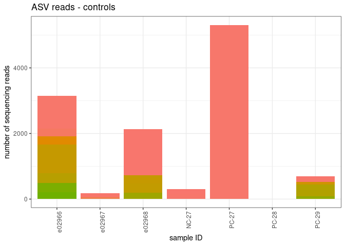<!-- -->

next we will subtract the maximum number of reads from ASVs found in the
extraction and pcr negative controls from all samples.

calculate the maximum number of reads in an ASV to still show up in an
extraction or PCR negative control

``` r
reads_to_remove_per_ASV <- asv_table_filter1.5 %>%
  filter(sample_type == "extraction_blank"| sample_type == "pcr_blank") %>%
  group_by(ASV) %>%
  summarize(max_reads = max(reads))

reads_to_remove_per_sample <- asv_table_filter1.5 %>%
  left_join(reads_to_remove_per_ASV, by = "ASV") %>%
  mutate(read_minus_contamination = reads - max_reads) %>%
  mutate(read_minus_contamination = if_else(read_minus_contamination < 0, 0, read_minus_contamination))
```

filter the data frame

``` r
asv_table_filter2 <- reads_to_remove_per_sample %>%
  dplyr::select(!reads) %>%
  dplyr::select(!max_reads) %>%
  dplyr::rename(reads = read_minus_contamination)
```

number of ASVs remaining

``` r
length(unique(asv_table_filter2$ASV)) 
```

    ## [1] 400

this step does remove a lot of reads from some of the ASVs but i think
this is okay since read numbers are quite high and we should see a clear
picture of species presence despite removing these reads

## 3. Discard PCR replicates with low numbers of reads

calculate reads per sample

``` r
all_reads <- asv_table_filter2 %>%
  group_by(Sample_ID) %>%
  summarize(ReadsPerSample = sum(reads))
```

visualize

``` r
all_reads$x_reordered <- reorder(all_reads$Sample_ID, -all_reads$ReadsPerSample)

all_reads %>%
  ggplot(aes(x = x_reordered, y = ReadsPerSample)) + 
  geom_bar(stat = "identity")
```

<!-- -->

fit a normal distribution

``` r
fit <- MASS::fitdistr(all_reads$ReadsPerSample, "normal")

all_reads %>%  
  mutate(prob = pnorm(all_reads$ReadsPerSample, fit$estimate[[1]], fit$estimate[[2]])) -> all_reads
```

identify and remove the outliers

``` r
#low_dist_probability_cutoff <- 0.05
minimum_read_cutoff <- 1000

outliers <- all_reads %>% 
  #filter(prob < low_dist_probability_cutoff | ReadsPerSample < minimum_read_cutoff)
  filter(ReadsPerSample < minimum_read_cutoff)

outlierIDs <- outliers$Sample_ID
```

which samples are removed because of the 1000 reads threshold??

``` r
replicates_removed <- asv_table_filter2 %>%
  filter(Sample_ID %in% outlierIDs) %>%
  pivot_wider(names_from = "ASV", values_from = "reads")
#head(replicates_removed_2)
```

number of pcr replicates removed

``` r
nrow(replicates_removed)
```

    ## [1] 14

plot them

``` r
replicates_removed %>%
  pivot_longer(cols = c(3:402), names_to = "ASV", values_to = "count") %>%
ggplot(aes(x=Sample_ID, y=count, fill=ASV)) +
  geom_bar(stat = "identity") + 
    theme_bw() + 
   labs(
    y = "sequencing reads",
    x = "sample ID",
    title = "samples with low read numbers")  +
  theme(
    axis.text.x = element_text(angle = 90, hjust = 0.95),
    legend.position = "none",
    legend.title = element_blank()
  )  
```

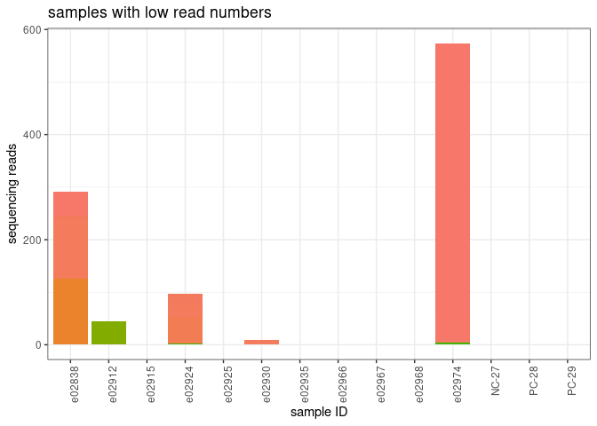<!-- -->

filter the data frame

``` r
asv_table_filter3 <- asv_table_filter2 %>%
  filter(!Sample_ID %in% outlierIDs)
```

## 4. Remove ASVs with low numbers of reads

what ASV’s have more than 1000 reads in the dataset?

``` r
asv_keepers <- asv_table_filter3 %>%
  group_by(ASV) %>%
  summarize(total = sum(reads)) %>%
  arrange(desc(total)) %>%
  filter(total > 1000)
```

``` r
asv_table_filter4 <- asv_table_filter3 %>%
  filter(ASV %in% asv_keepers$ASV)
```

## 5. Join to taxonomy and get rid of ASVs with no ID

because the insect and the blastn classifiers aren’t perfect on their
own, i combined the outputs by hand for our remaining ASVs

``` r
my_tax <- read.csv("asv_taxonomy_pinkherringdiet_custom.csv")
```

join to taxononmy and group reads by taxon assigment

``` r
taxon_table <- asv_table_filter4 %>%
  separate(ASV, into = c("ASV_label", "ASV_num"), remove = F) %>%
  mutate(ASV_num = as.integer(ASV_num)) %>%
  left_join(my_tax, by = "ASV_num") %>%
  select(!ASV_label) %>%
  select(!ASV_num) %>% 
  select(!representative) %>%
  group_by(Sample_ID, taxon, rank, order, family, genus, species) %>%
  summarize(reads = sum(reads)) %>%
  filter(!is.na(taxon))
```

    ## `summarise()` has grouped output by 'Sample_ID', 'taxon', 'rank', 'order',
    ## 'family', 'genus'. You can override using the `.groups` argument.

join the sample metadata so that we know which species of fish the
sample came from

``` r
taxon_table_w_meta <- taxon_table %>%
  left_join(metadata, by = "Sample_ID") %>%
  filter(sample_type != "positive")
```

# Pacific herring

## let’s look at what taxa are the in Pacific herring stomach samples

``` r
herring_stomachs <- taxon_table_w_meta %>% 
  filter(Species == "Pacific herring")

herring_stomachs %>%
  group_by(taxon) %>%
  summarise(total = sum(reads)) %>%
  arrange(desc(total))
```

    ## # A tibble: 21 × 2
    ##    taxon                     total
    ##    <chr>                     <dbl>
    ##  1 Clupea pallasii        1518201.
    ##  2 Sebastes                172086 
    ##  3 Gadus                   166625 
    ##  4 Leuroglossus schmidti   114885 
    ##  5 Pleuronectidae           80821 
    ##  6 Stichaeus punctatus      29238 
    ##  7 Aptocyclus ventricosus   19231 
    ##  8 Anoplarchus              13364 
    ##  9 Zaprora silenus          12694 
    ## 10 Bathymaster              10186 
    ## # ℹ 11 more rows

total number of reads in herring stomachs

``` r
sum(herring_stomachs$reads)
```

    ## [1] 2174810

number and proportion of non-herring reads

``` r
sum(herring_stomachs$reads) - 1518201
```

    ## [1] 656608.7

``` r
(sum(herring_stomachs$reads) - 1518201) / sum(herring_stomachs$reads)
```

    ## [1] 0.3019155

how many samples? how many stomachs?

``` r
length(unique(herring_stomachs$Sample_ID))
```

    ## [1] 83

``` r
length(unique(herring_stomachs$FishID))
```

    ## [1] 74

which stomachs had multiple extractions?

``` r
replicates <- metadata %>%
  group_by(Species, FishID) %>%
  summarise(n_extractions = n()) %>%
  filter(n_extractions > 1)
```

    ## `summarise()` has grouped output by 'Species'. You can override using the
    ## `.groups` argument.

``` r
replicates
```

    ## # A tibble: 13 × 3
    ## # Groups:   Species [4]
    ##    Species         FishID   n_extractions
    ##    <chr>           <chr>            <int>
    ##  1 Pacific herring 23-5-171             2
    ##  2 Pacific herring 23-5-173             2
    ##  3 Pacific herring 23-5-18              2
    ##  4 Pacific herring 23-5-185             2
    ##  5 Pacific herring 23-5-220             2
    ##  6 Pacific herring 23-5-253             2
    ##  7 Pacific herring 23-5-255             2
    ##  8 Pacific herring 23-5-295             2
    ##  9 Pacific herring 23-5-298             2
    ## 10 Pacific herring 23-5-77              2
    ## 11 Pink salmon     23-7-18              2
    ## 12 blank           <NA>                 3
    ## 13 <NA>            <NA>                 4

plot reads WITH herring

``` r
herring_stomachs %>%
  #filter(family != "Clupeidae") %>%
ggplot(aes(x=Sample_ID, y=reads, fill=taxon)) +
  geom_bar(stat = "identity") + 
    theme_bw() + 
   labs(
    y = "sequencing reads",
    x = "sample ID",
    title = "herring stomachs with herring reads")  +
  theme(
    axis.text.x = element_text(angle = 90, hjust = 0.95),
    legend.position = "none",
    legend.title = element_blank()
  )  
```

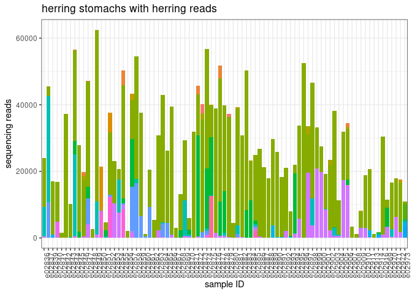<!-- -->

plot reads WITHOUT herring

``` r
herring_stomachs %>%
  filter(family != "Clupeidae") %>%
ggplot(aes(x=Sample_ID, y=reads, fill=taxon)) +
  geom_bar(stat = "identity") + 
    theme_bw() + 
   labs(
    y = "sequencing reads",
    x = "sample ID",
    title = "herring stomachs without herring reads")  +
  theme(
    axis.text.x = element_text(angle = 90, hjust = 0.95),
    legend.position = "none",
    legend.title = element_blank()
  )  
```

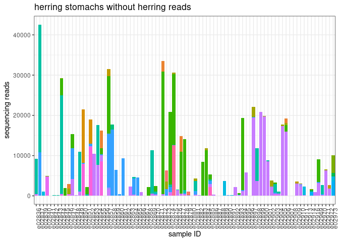<!-- -->

let’s say a sample need \>1000 non-herring reads in order to establish
its diet

``` r
herring_diet <- herring_stomachs %>%
  filter(family != "Clupeidae") %>%
  group_by(Sample_ID) %>%
  mutate(ReadsPerSample = sum(reads)) %>%
  filter(ReadsPerSample > 1000) %>%
  mutate(read_prop = reads/ReadsPerSample)
```

how many samples?

``` r
length(unique(herring_diet$FishID))
```

    ## [1] 52

``` r
length(unique(herring_diet$Sample_ID))
```

    ## [1] 59

plot them - number of reads

``` r
herring_diet %>%
ggplot(aes(x=Sample_ID, y=reads, fill=taxon)) +
  geom_bar(stat = "identity") + 
    theme_bw() + 
   labs(
    y = "number  of sequencing reads",
    x = "sample ID",
    title = "herring stomachs")  +
  theme(
    axis.text.x = element_text(angle = 90, hjust = 0.95),
    legend.position = "none",
    legend.title = element_blank()
  )  
```

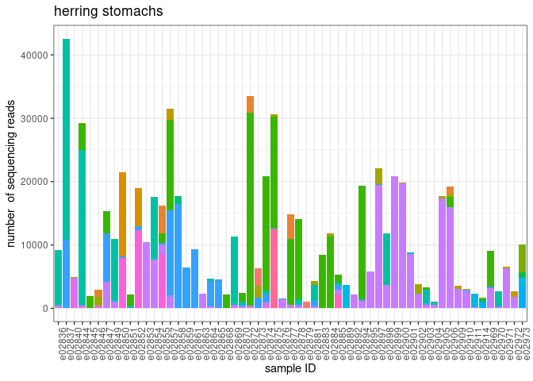<!-- -->

plot them - proportion

``` r
herring_diet %>%
ggplot(aes(x=Sample_ID, y=read_prop, fill=taxon)) +
  geom_bar(stat = "identity") + 
    theme_bw() + 
   labs(
    y = "proportion of sequencing reads",
    x = "sample ID",
    title = "herring stomachs")  +
  theme(
    axis.text.x = element_text(angle = 90, hjust = 0.95),
    legend.position = "right",
    legend.text = element_text(size = 6),
    legend.title = element_blank()
  )  
```

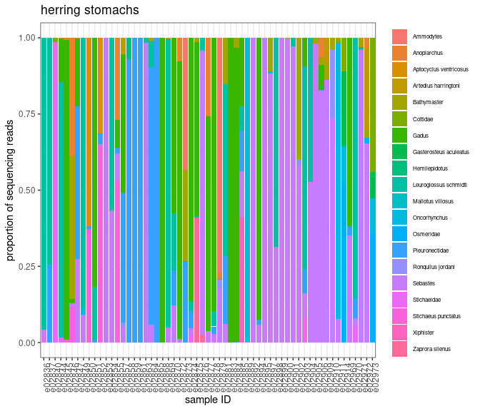<!-- -->

total number of reads assigned to taxa in herring stomachs

``` r
herring_diet %>%
  group_by(taxon) %>%
  summarize(total = sum(reads)) %>%
  arrange(desc(total))
```

    ## # A tibble: 20 × 2
    ##    taxon                    total
    ##    <chr>                    <dbl>
    ##  1 Sebastes               169160 
    ##  2 Gadus                  166259 
    ##  3 Leuroglossus schmidti  114684 
    ##  4 Pleuronectidae          80210 
    ##  5 Stichaeus punctatus     29225 
    ##  6 Aptocyclus ventricosus  19231 
    ##  7 Anoplarchus             13364 
    ##  8 Zaprora silenus         12619 
    ##  9 Bathymaster             10162 
    ## 10 Oncorhynchus             7663.
    ## 11 Stichaeidae              6671 
    ## 12 Cottidae                 4787 
    ## 13 Osmeridae                4536 
    ## 14 Ammodytes                3599 
    ## 15 Artedius harringtoni     2725 
    ## 16 Xiphister                2173 
    ## 17 Gasterosteus aculeatus   1311 
    ## 18 Hemilepidotus            1241 
    ## 19 Ronquilus jordani        1237 
    ## 20 Mallotus villosus          19

average proportion of reads in herring stomachs (NA;s removed)

``` r
herring_diet %>%
  group_by(taxon) %>%
  summarize(avg_prop = mean(read_prop, rm.na = T)) %>%
  arrange(desc(avg_prop))
```

    ## # A tibble: 20 × 2
    ##    taxon                   avg_prop
    ##    <chr>                      <dbl>
    ##  1 Sebastes               0.297    
    ##  2 Gadus                  0.206    
    ##  3 Leuroglossus schmidti  0.151    
    ##  4 Pleuronectidae         0.119    
    ##  5 Oncorhynchus           0.0368   
    ##  6 Bathymaster            0.0286   
    ##  7 Stichaeus punctatus    0.0284   
    ##  8 Ammodytes              0.0204   
    ##  9 Stichaeidae            0.0203   
    ## 10 Anoplarchus            0.0189   
    ## 11 Aptocyclus ventricosus 0.0159   
    ## 12 Osmeridae              0.0152   
    ## 13 Cottidae               0.00973  
    ## 14 Zaprora silenus        0.00739  
    ## 15 Xiphister              0.00699  
    ## 16 Artedius harringtoni   0.00686  
    ## 17 Gasterosteus aculeatus 0.00568  
    ## 18 Ronquilus jordani      0.00481  
    ## 19 Hemilepidotus          0.00119  
    ## 20 Mallotus villosus      0.0000283

a few stomachs had duplicate DNA extractions, let’s check out those
samples

``` r
herring_replicates <- herring_diet %>%
  filter(FishID %in% replicates$FishID)
```

``` r
herring_replicates %>%
ggplot(aes(x=Sample_ID, y=read_prop, fill=taxon)) +
  geom_bar(stat = "identity") + 
    theme_bw() + 
   labs(
    y = "proportion of sequencing reads",
    x = "sample ID",
    title = "herring stomachs")  +
  facet_wrap(~FishID, scales = 'free') + 
  theme(
    axis.text.x = element_blank(),
    legend.position = "right",
    legend.text = element_text(size = 6),
    legend.title = element_blank()
  )  
```

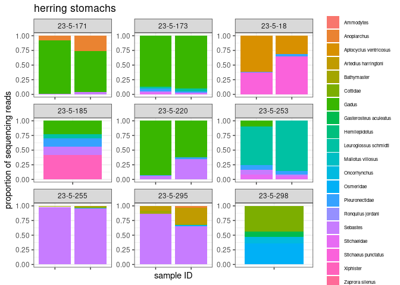<!-- -->

okay, cool. the stomachs with replicate samples that both made it
through the filtering do generally look similar.

which herring stomachs have salmon reads?

``` r
samples_w_salmon <- herring_diet %>%
  filter(taxon == "Oncorhynchus") %>%
  filter(reads > 0)

herring_diet %>%
  filter(Sample_ID %in% samples_w_salmon$Sample_ID) %>%
ggplot(aes(x=Sample_ID, y=read_prop, fill=taxon)) +
  geom_bar(stat = "identity") + 
    theme_bw() + 
   labs(
    y = "proportion of sequencing reads",
    x = "sample ID",
    title = "herring stomachs w Oncorhynchus reads")  +
  facet_wrap(~FishID, scales = 'free') + 
  theme(
    #axis.text.x = element_text(angle = 90, hjust = 0.95),
    axis.text.x = element_blank(),
    legend.position = "right",
    legend.text = element_text(size = 6),
    legend.title = element_blank()
  )  
```

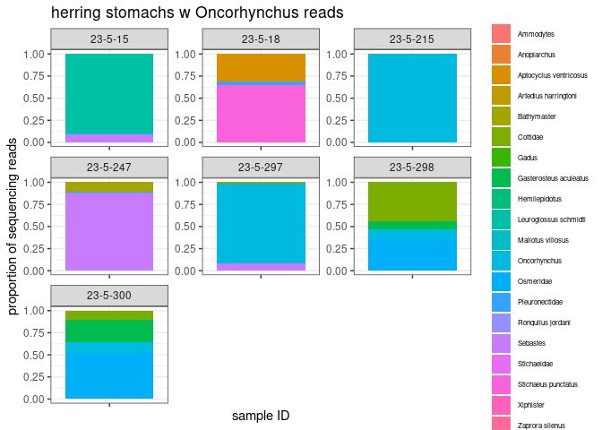<!-- -->

2 stomachs do have large proportions (\>90%) salmon reads. read numbers
aren’t huge for these samples (2000-4000 reads).

# Pink salmon

## let’s look at what species are the in pink salmon stomach samples

``` r
pink_stomachs <- taxon_table_w_meta %>% 
  filter(Species == "Pink salmon")

pink_stomachs %>%
  group_by(taxon) %>%
  summarise(total = sum(reads)) %>%
  arrange(desc(total))
```

    ## # A tibble: 21 × 2
    ##    taxon                    total
    ##    <chr>                    <dbl>
    ##  1 Oncorhynchus          1471939.
    ##  2 Sebastes               139928 
    ##  3 Clupea pallasii        133658.
    ##  4 Gadus                   13482 
    ##  5 Mallotus villosus        2385 
    ##  6 Cottidae                  405 
    ##  7 Leuroglossus schmidti     178 
    ##  8 Osmeridae                 167 
    ##  9 Pleuronectidae             50 
    ## 10 Ammodytes                  46 
    ## # ℹ 11 more rows

total number of reads in pink salmon samples

``` r
sum(pink_stomachs$reads)
```

    ## [1] 1762305

number and proportion of non-herring reads

``` r
sum(pink_stomachs$reads) - 1471939
```

    ## [1] 290366.3

``` r
(sum(pink_stomachs$reads) - 1471939) / sum(pink_stomachs$reads)
```

    ## [1] 0.1647651

how many samples? how many stomachs?

``` r
length(unique(pink_stomachs$Sample_ID))
```

    ## [1] 45

``` r
length(unique(pink_stomachs$FishID))
```

    ## [1] 45

``` r
pink_stomachs %>%
ggplot(aes(x=Sample_ID, y=reads, fill=taxon)) +
  geom_bar(stat = "identity") + 
    theme_bw() + 
   labs(
    y = "sequencing reads",
    x = "sample ID",
    title = "pink salmon stomachs with salmon reads")  +
  theme(
    axis.text.x = element_text(angle = 90, hjust = 0.95),
    legend.position = "right",
    legend.title = element_blank(),
    legend.text = element_text(size = 6)
  )  
```

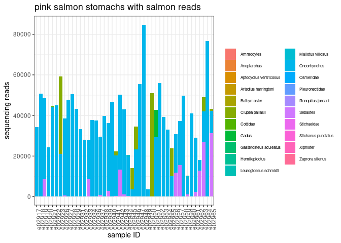<!-- -->

``` r
pink_stomachs %>%
  filter(taxon != "Oncorhynchus") %>%
ggplot(aes(x=Sample_ID, y=reads, fill=taxon)) +
  geom_bar(stat = "identity") + 
    theme_bw() + 
   labs(
    y = "sequencing reads",
    x = "sample ID",
    title = "pink salmon stomach without salmon reads")  +
  theme(
    axis.text.x = element_text(angle = 90, hjust = 0.95),
    legend.position = "right",
    legend.title = element_blank(),
    legend.text = element_text(size = 6)
  )  
```

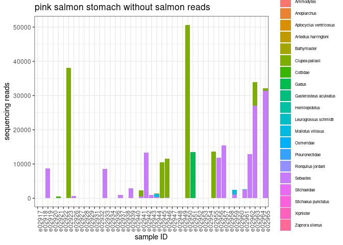<!-- -->

let’s say a sample need \>1000 non-herring reads in order to establish
its diet

``` r
pink_diet <- pink_stomachs %>%
  filter(taxon != "Oncorhynchus") %>%
  group_by(Sample_ID) %>%
  mutate(ReadsPerSample = sum(reads)) %>%
  filter(ReadsPerSample > 1000) %>%
  mutate(read_prop = reads/ReadsPerSample)
```

how many samples?

``` r
length(unique(pink_diet$Sample_ID))
```

    ## [1] 20

``` r
length(unique(pink_diet$FishID))
```

    ## [1] 20

plot them - number of reads

``` r
pink_diet %>%
ggplot(aes(x=Sample_ID, y=reads, fill=taxon)) +
  geom_bar(stat = "identity") + 
    theme_bw() + 
   labs(
    y = "number of sequencing reads",
    x = "sample ID",
    title = "pink salmon stomachs")  +
  theme(
    axis.text.x = element_text(angle = 90, hjust = 0.95),
    legend.position = "right",
    legend.title = element_blank(),
    legend.text = element_text(size = 6)
  )  
```

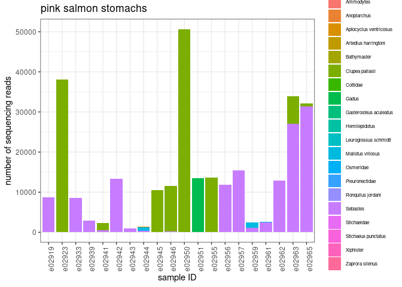<!-- -->

plot them - proportion of reads

``` r
pink_diet %>%
ggplot(aes(x=Sample_ID, y=read_prop, fill=taxon)) +
  geom_bar(stat = "identity") + 
    theme_bw() + 
   labs(
    y = "proportion of sequencing reads",
    x = "sample ID",
    title = "pink salmon stomachs")  +
  theme(
    axis.text.x = element_text(angle = 90, hjust = 0.95),
    legend.position = "right",
    legend.title = element_blank(),
    legend.text = element_text(size = 8),
  )  
```

<!-- -->

``` r
pink_diet %>%
  group_by(taxon) %>%
  summarize(total = sum(reads)) %>%
  arrange(desc(total))
```

    ## # A tibble: 20 × 2
    ##    taxon                    total
    ##    <chr>                    <dbl>
    ##  1 Sebastes               138023 
    ##  2 Clupea pallasii        133650.
    ##  3 Gadus                   13482 
    ##  4 Mallotus villosus        2365 
    ##  5 Osmeridae                 114 
    ##  6 Stichaeus punctatus        25 
    ##  7 Aptocyclus ventricosus     19 
    ##  8 Ammodytes                   0 
    ##  9 Anoplarchus                 0 
    ## 10 Artedius harringtoni        0 
    ## 11 Bathymaster                 0 
    ## 12 Cottidae                    0 
    ## 13 Gasterosteus aculeatus      0 
    ## 14 Hemilepidotus               0 
    ## 15 Leuroglossus schmidti       0 
    ## 16 Pleuronectidae              0 
    ## 17 Ronquilus jordani           0 
    ## 18 Stichaeidae                 0 
    ## 19 Xiphister                   0 
    ## 20 Zaprora silenus             0

``` r
pink_diet %>%
  group_by(taxon) %>%
  summarize(avg_prop = mean(read_prop, rm.na = T)) %>%
  arrange(desc(avg_prop))
```

    ## # A tibble: 20 × 2
    ##    taxon                  avg_prop
    ##    <chr>                     <dbl>
    ##  1 Sebastes               0.584   
    ##  2 Clupea pallasii        0.299   
    ##  3 Mallotus villosus      0.0632  
    ##  4 Gadus                  0.0503  
    ##  5 Osmeridae              0.00223 
    ##  6 Aptocyclus ventricosus 0.000705
    ##  7 Stichaeus punctatus    0.000108
    ##  8 Ammodytes              0       
    ##  9 Anoplarchus            0       
    ## 10 Artedius harringtoni   0       
    ## 11 Bathymaster            0       
    ## 12 Cottidae               0       
    ## 13 Gasterosteus aculeatus 0       
    ## 14 Hemilepidotus          0       
    ## 15 Leuroglossus schmidti  0       
    ## 16 Pleuronectidae         0       
    ## 17 Ronquilus jordani      0       
    ## 18 Stichaeidae            0       
    ## 19 Xiphister              0       
    ## 20 Zaprora silenus        0

which pink stomachs have herring reads?

``` r
samples_w_herring <- pink_diet %>%
  filter(taxon == "Clupea pallasii") %>%
  filter(reads > 0)

pink_diet %>%
  filter(Sample_ID %in% samples_w_herring$Sample_ID) %>%
ggplot(aes(x=Sample_ID, y=read_prop, fill=taxon)) +
  geom_bar(stat = "identity") + 
    theme_bw() + 
   labs(
    y = "proportion of sequencing reads",
    x = "sample ID",
    title = "pink stomachs w Clupea pallasii reads")  +
  #facet_wrap(~FishID, scales = 'free') + 
  theme(
    axis.text.x = element_text(angle = 90, hjust = 0.95),
    #axis.text.x = element_blank(),
    legend.position = "right",
    legend.text = element_text(size = 6),
    legend.title = element_blank()
  )  
```

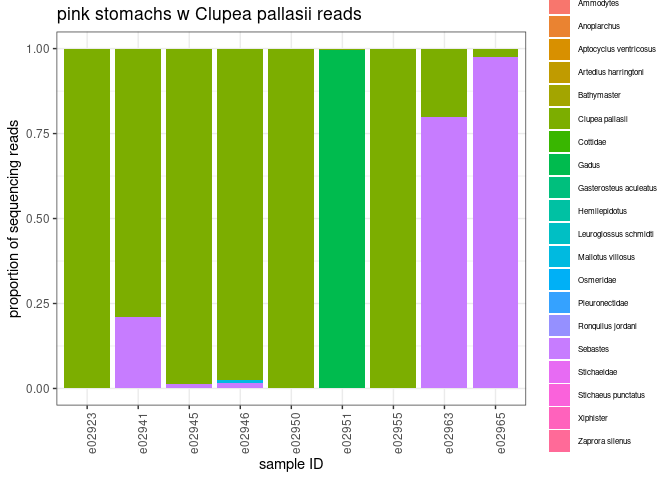<!-- -->

## format results for output table

start with metadata

``` r
meta_mini <- metadata %>%
  filter(sample_type == "sample") %>%
  select(Sample_ID:location) %>%
  mutate(extracted = "yes") %>%
  mutate(pass_QC = "NA")
```

pivot herring diet

``` r
herring_wide <- herring_diet %>%
  select(Sample_ID, FishID, ReadsPerSample, taxon, read_prop) %>%
  pivot_wider(names_from = taxon, values_from = read_prop)
```

pivot pink diet

``` r
pink_wide <- pink_diet %>%
  select(Sample_ID, FishID, ReadsPerSample, taxon, read_prop) %>%
  pivot_wider(names_from = taxon, values_from = read_prop)
```

join tables

``` r
join1 <- herring_wide %>%
  bind_rows(pink_wide)

join2 <- meta_mini %>%
  left_join(join1) %>%
  mutate(pass_QC = ifelse(is.na(ReadsPerSample), "no", "yes"))
```

    ## Joining with `by = join_by(Sample_ID, FishID)`

save output

``` r
#write.csv(join2, "pinkherring_mifish_output.csv")
```
